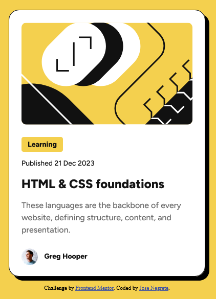

# Frontend Mentor - Blog preview card solution

This is a solution to the [Blog preview card challenge on Frontend Mentor](https://www.frontendmentor.io/challenges/blog-preview-card-ckPaj01IcS). Frontend Mentor challenges help you improve your coding skills by building realistic projects. 

## Table of contents

- [Overview](#overview)
  - [The challenge](#the-challenge)
  - [Screenshot](#screenshot)
  - [Links](#links)
- [My process](#my-process)
  - [Built with](#built-with)
  - [What I learned](#what-i-learned)
  - [Continued development](#continued-development)
  - [Useful resources](#useful-resources)
- [Author](#author)
- [Acknowledgments](#acknowledgments)

**Note: Delete this note and update the table of contents based on what sections you keep.**

## Overview

### The challenge

Users should be able to:

- See hover and focus states for all interactive elements on the page

### Screenshot



### Links

- Solution URL: (https://github.com/josenegrete123/Blog-Preview-Card)
- Live Site URL: (https://josenegrete123.github.io/Blog-Preview-Card/)

## My process

### Built with

- Semantic HTML5 markup
- CSS custom properties
- Flexbox

### What I learned

Learned more on how to include an image and size it. As well on how to organize my html using the div element. Learned also how to use the ::before pseudo-element.

```html
<div class="card">
        <div class="blog-image"></div>
  
        <div class="content"></div>
</div>
```
```css
.blog-image {
    content: url("./assets/images/illustration-article.svg");
    width: auto;
    height: auto;
    border-radius: 10px;
    align-self: stretch;
}

.author::before {
    content: "";
    background: url("./assets/images/image-avatar.webp");
    position: relative;
    background-size: cover;
    background-repeat: no-repeat;
    width: 32px;
    height: 32px;
}
```

### Continued development

Want to focus better on figuring out when to use flex and grid displays. As well as figuring out how to read the figma files to better implement the CSS.

### Useful resources

- [CSS ::before pseudo element](https://stackoverflow.com/questions/6668577/using-before-css-pseudo-element-to-add-image-to-modal) - This helped me add an image to the pseudo element ::before and how to resize it as well.
- [Scalable text depending on viewport size](https://stackoverflow.com/questions/35978790/bigger-fonts-on-smaller-screens-without-media-queries-or-javascript) - This is an amazing article which helped me find out how to scale the text depending on the viewport sizes.
- [Program to scale text](https://clamp.font-size.app/?config=eyJyb290IjoiMTYiLCJtaW5XaWR0aCI6IjUwMHB4IiwibWF4V2lkdGgiOiI5MDBweCIsIm1pbkZvbnRTaXplIjoiMTJweCIsIm1heEZvbnRTaXplIjoiMTRweCJ9) - Used this amazing program to scale the text by giving the minimum and maximum font sizes

## Author

- GitHub - [Jose Negrete](https://github.com/josenegrete123/)
- Frontend Mentor - [@josenegrete123](https://www.frontendmentor.io/profile/josenegrete123)